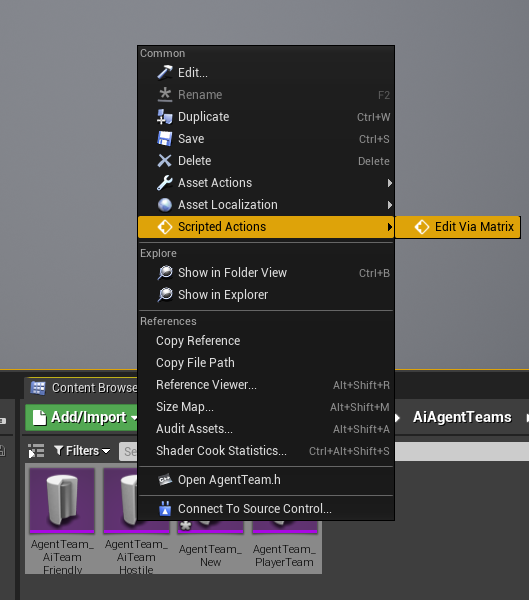

# AssetDrivenAIAgentTeams
License: CC BY-NC  
Author: Dominik Rudnik (Qikcik)

## Video Demo

## Purpose of this plugin
It was created to allow designer using only blueprint to define ai agent character teams, and relations between them.

## How to use them
### Adding Teams
After enabling plugin inside project you will can create new AgentTeam from context menu in content browser
  

### Editing Team
You can edit it single via data asset details panel
  
**Default Attitude to strangers** Is attitude to all teams that arent specified in Attitude Towards.

### Editing Teams by edit via matrix
Or you can use EditViaMatrix from Scripted Actions
  
 
**At the bottom control buttons:**
- Add, open dialog for creating new Agent Teams
- Save All, save all actually editing Agent Teams
- Get All From Asset Registry, show in matrix all Agent Teams that are in main Content folder
- Get Selected In Content Browser, show in matrix all Agent Teams that are actually selected in content browser

**Columns represents Each Agent Teams**
- you can change Agent Teams name
- specifies Default Attitude to strangers.
- Edit button, open current Agent Teams in data asset details panel
- Each others Columns represents Attitude toward specifics Teams 

## How to assign Team to Character
first of all character need to inherit from **TeamedCharacter**
*(if you have yours c++ Character base class, you can copy Team implementation from **TeamedCharacter**)*
  
Now you can specify character team via Team variable inside TeamedCharacter category.
  

**That's all!**